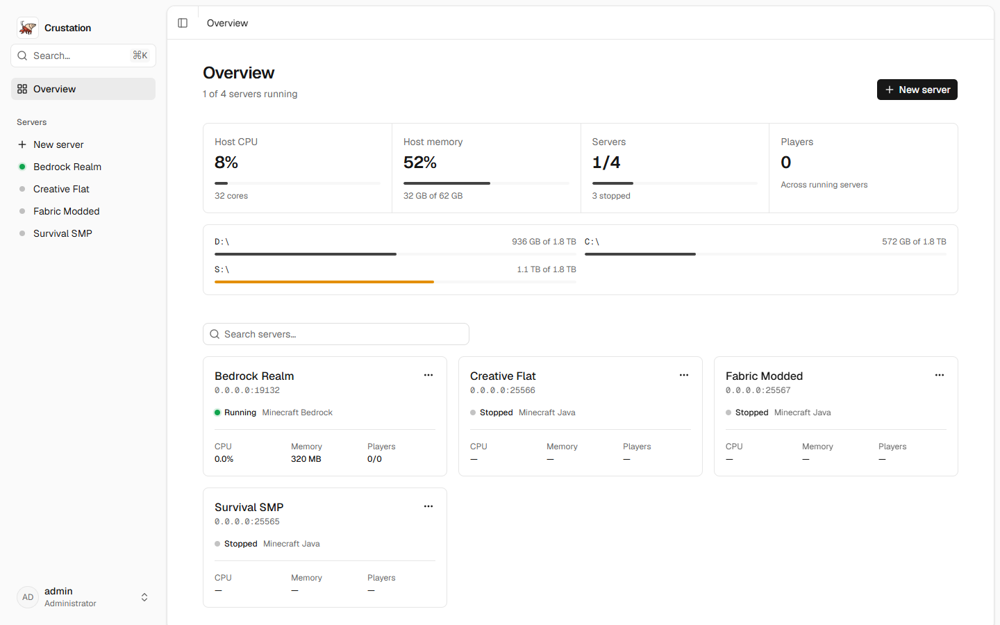
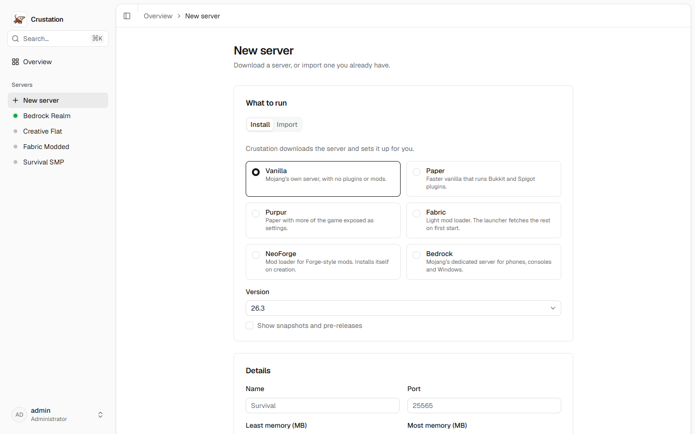
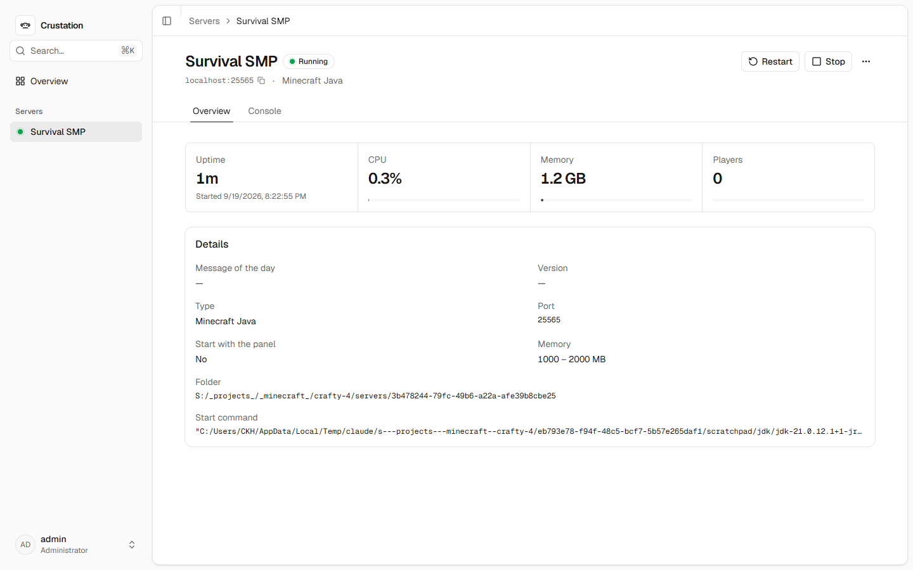
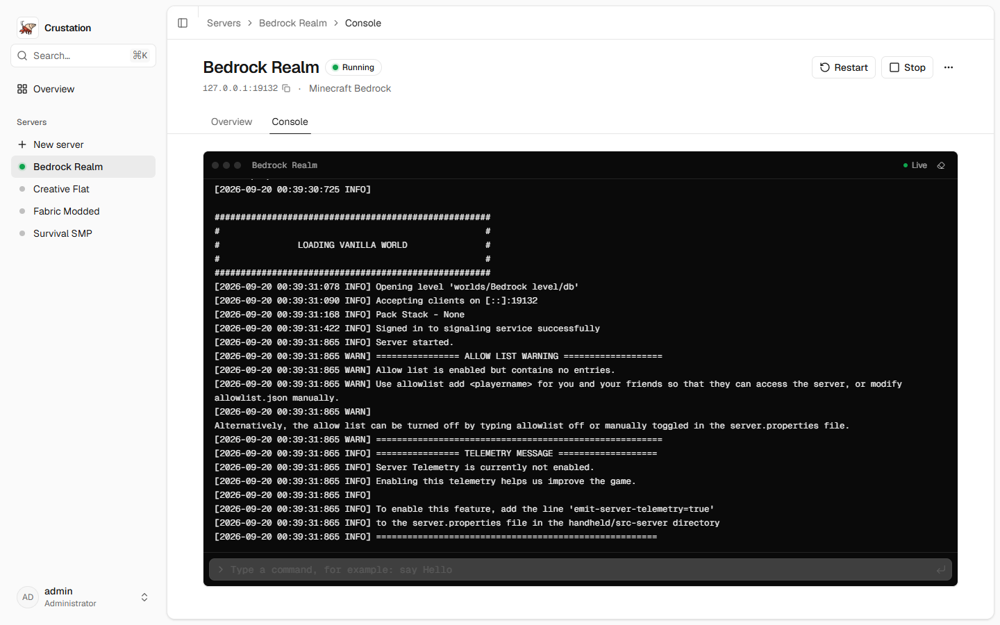

# Crustation

Run your Minecraft servers from a web page. One Rust binary supervises the servers and serves the
interface, so there is one container to deploy and one SQLite file to back up.

Crab, Rust, shells. The name wrote itself.

> **Built with AI, directed by a human.** Most of the code here is written by an AI assistant
> working to decisions I make: the architecture, the API contract in [docs/API.md](docs/API.md),
> and the order of work in [docs/ROADMAP.md](docs/ROADMAP.md).
>
> This is not prompt-and-ship. Nothing merges that fails `cargo fmt`, `clippy -D warnings`, the
> test suite or the interface build, and features are exercised against a running panel before
> they go out. It runs on your hardware, so you should know how it was made.



## What works today

- **Create a server** from Vanilla, Paper, Purpur, Fabric, NeoForge or Bedrock. Crustation
  downloads it, accepts the EULA, sets the port and picks a Java version that suits it. Choose
  the seed, world type, difficulty, game mode and slots while you are there.
- **Import a server** you already have, from a zip, a folder on the host, or a download link.
- **Start, stop, restart and kill**, with crash detection and restart on boot.
- **A live console** you can type into. Commands go over RCON when a Java server has it set up.
- **Stats** for the host and for each server process, with history.
- **Users, roles and API keys**, with per-server permissions.
- **Add-ons and worlds** on their own tab: install a .mcaddon or .mcpack and it is unpacked where
  the server reads it and switched on for the world you pick; import a .mcworld and it lands under
  `worlds/` under the name it gives itself.
- **An MCP server** at `/mcp`, so an assistant can read a console and act on a server through the
  same permissions an API key already has. See [docs/API.md](docs/API.md).

Not there yet: files, backups, schedules, player lists, webhooks, and the screens for managing
users. [docs/ROADMAP.md](docs/ROADMAP.md) has the order they are coming in.

## Install

### Docker

```bash
docker run -d --name crustation \
  -p 8080:8080 -p 25565:25565 -p 19132:19132/udp \
  -v /srv/crustation/config:/config \
  -v /srv/crustation/servers:/servers \
  -v /srv/crustation/backups:/backups \
  -e PUID=1000 -e PGID=1000 \
  ghcr.io/juddisjudd/crustation:latest
```

`docker-compose.yml` does the same thing. The image carries Java 8, 11, 17, 21 and 25, and each
server starts on whichever one its version asks for.

### Unraid

The template lives in
[juddisjudd/unraid-templates](https://github.com/juddisjudd/unraid-templates), the repository
Community Applications already indexes. Two ways to add it:

- **Docker → Add Container → Template URL**, then paste
  <https://raw.githubusercontent.com/juddisjudd/unraid-templates/main/templates/crustation.xml>
- **Community Applications → Additional Repositories**, then add that repository

It maps config, servers and backups as three shares and honours `PUID` and `PGID`, so files stay
owned by your Unraid user rather than root.

### From source

```bash
cd web && pnpm install && pnpm build && cd ..
cargo run --release
```

Data lands in `./config`, `./servers` and `./backups`. For interface work, run `pnpm dev` in
`web/`; Vite proxies the API and the WebSocket to the panel on port 8080.

## First sign-in

Open <http://localhost:8080>. The panel creates an administrator the first time it starts.

Set `CRUSTATION_ADMIN_USERNAME` and `CRUSTATION_ADMIN_PASSWORD` to choose your own. Otherwise
Crustation generates a password and writes it to `config/first-login.txt`. Change it after signing
in, then delete that file.







## Configuration

`config/crustation.toml` appears on first start and can be edited. Environment variables override
it, which is how the container is configured.

| Variable | Meaning |
| --- | --- |
| `CRUSTATION_PORT`, `CRUSTATION_ADDRESS` | Where the panel listens |
| `CRUSTATION_PUBLIC_URL` | External address behind a reverse proxy; turns on secure cookies |
| `CRUSTATION_CONFIG_DIR`, `CRUSTATION_SERVERS_DIR`, `CRUSTATION_BACKUPS_DIR` | Data locations |
| `CRUSTATION_ADMIN_USERNAME`, `CRUSTATION_ADMIN_PASSWORD` | First administrator |
| `CRUSTATION_LOG` | Log filter, for example `debug` |
| `CRUSTATION_MCP_ENABLED` | Set to `false` to stop serving the MCP endpoint at `/mcp` |

## Why another one

[Crafty Controller](https://gitlab.com/crafty-controller/crafty-4) has the right idea and I ran it
for a while. Crustation is the same tool on different foundations: one binary and one SQLite file
to deploy, an API built for a single-page interface, and a WebSocket that re-checks permissions on
every event it sends.

## Contributing

```
src/            the panel: http, auth, supervisor, providers, installs, stats, events
migrations/     SQLite schema
web/            the Svelte interface
docker/         container entrypoint
docs/           architecture, API contract, roadmap
```

[docs/ARCHITECTURE.md](docs/ARCHITECTURE.md) covers how the pieces fit together.
[docs/API.md](docs/API.md) is the contract between the panel and the interface; change one side
without the other and things break quietly.

Before opening a pull request:

```bash
cargo fmt --check && cargo clippy --all-targets -- -D warnings && cargo test
cd web && pnpm check && pnpm lint && pnpm build
```

## Licence

AGPL-3.0-or-later. Run a modified copy as a service and you owe the world your changes.
